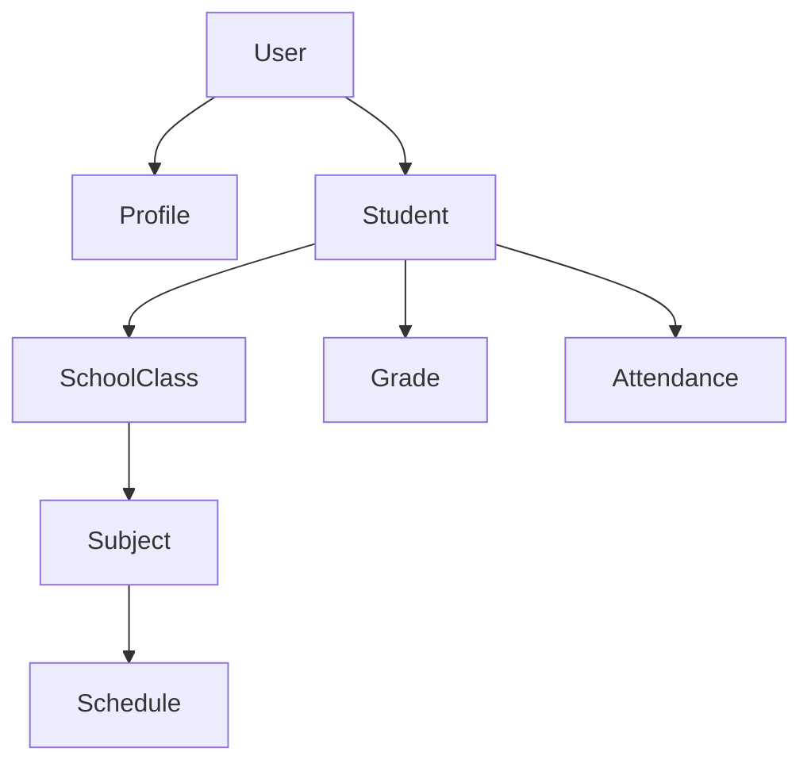

# 🎓 EduConnect - Setup Guide

<div align="center">


_A comprehensive school management system built with Laravel and Vue.js_

</div>

---

## 📋 Table of Contents

-   [🚀 Quick Start](#-quick-start)
-   [📦 Package Installation](#-package-installation)
-   [🔧 Configuration](#-configuration)
-   [🏗️ Model Generation](#️-model-generation)
-   [🎯 Core Features](#-core-features)
-   [📚 Documentation](#-documentation)

---

## 🚀 Quick Start

### Prerequisites

-   PHP 8.1 or higher
-   Composer
-   Node.js & NPM
-   MySQL 8.0+

### Initial Setup

```bash
# Create new Laravel project
composer create-project laravel/laravel:^10.0 EduConnect
cd EduConnect
```

---

## 📦 Package Installation

### 🔐 Authentication & Authorization

```bash
# Install Laravel Breeze with Vue.js
composer require laravel/breeze --dev
php artisan breeze:install vue

# Install Spatie Permission Package
composer require spatie/laravel-permission
php artisan vendor:publish --provider="Spatie\Permission\PermissionServiceProvider"
```

### 🛡️ API Authentication

```bash
# Install Laravel Sanctum
composer require laravel/sanctum
```

### 🔧 Development Tools

```bash
# Install IDE Helper for better development experience
composer require barryvdh/laravel-ide-helper --dev

# Generate IDE helper files
php artisan ide-helper:generate
php artisan ide-helper:models --nowrite
php artisan ide-helper:meta

composer require laravel/sail --dev
php artisan sail:install
```

---

## 🏗️ Model Generation

### 🏛️ Core System Models

```bash
# User Profile Management
php artisan make:model Profile -a
```

### 🎓 Academic Management

<details>
<summary><strong>Click to expand Academic Models</strong></summary>

```bash
# Academic Structure
php artisan make:model AcademicYear -a
php artisan make:model SchoolClass -a
php artisan make:model Student -a
php artisan make:model StudentGuardian -a

# Curriculum Management
php artisan make:model Subject -a
php artisan make:model Schedule -a

# Assessment & Monitoring
php artisan make:model Grade -a
php artisan make:model Attendance -a
php artisan make:model Discipline -a
```

</details>

### 💰 Financial Management

<details>
<summary><strong>Click to expand Financial Models</strong></summary>

```bash
# Billing & Payments
php artisan make:model Invoice -a
php artisan make:model Payment -a
```

</details>

### 📚 Additional Modules

<details>
<summary><strong>Click to expand Additional Models</strong></summary>

```bash
# Library Management
php artisan make:model LibraryBook -a
php artisan make:model LibraryTransaction -a

# Event Management
php artisan make:model Event -a
php artisan make:model EventRegistration -a
```

composer require spatie/laravel-permission

</details>

---

## 🎯 Core Features

| Module                  | Description                             | Status |
| ----------------------- | --------------------------------------- | ------ |
| 👥 **User Management**  | Role-based access control with profiles | ✅     |
| 🎓 **Academic System**  | Classes, students, subjects, schedules  | ✅     |
| 📊 **Grade Management** | Assessment and grade tracking           | ✅     |
| 📅 **Attendance**       | Student attendance monitoring           | ✅     |
| 💰 **Financial**        | Invoice and payment processing          | ✅     |
| 📚 **Library**          | Book management and transactions        | ✅     |
| 🎉 **Events**           | School event management                 | ✅     |

---

## 🔧 Configuration

### Environment Setup

1. Copy the environment file:

    ```bash
    cp .env.example .env
    ```

2. Generate application key:

    ```bash
    php artisan key:generate
    ```

3. Configure your database in `.env`:

    ```env
    DB_CONNECTION=mysql
    DB_HOST=127.0.0.1
    DB_PORT=3306
    DB_DATABASE=educonnect
    DB_USERNAME=your_username
    DB_PASSWORD=your_password
    ```

4. Run migrations:

    ```bash
    php artisan migrate
    ```

5. Install frontend dependencies:
    ```bash
    npm install && npm run dev
    ```

---

## 📚 Documentation

### Model Relationships



### Quick Commands Reference

| Command               | Description                    |
| --------------------- | ------------------------------ |
| `php artisan serve`   | Start development server       |
| `php artisan migrate` | Run database migrations        |
| `php artisan db:seed` | Seed database with sample data |
| `npm run dev`         | Start Vite development server  |
| `npm run build`       | Build for production           |

---

---

## Ki thuat xu ly them

Spatie Permission
Để tăng hiệu suất, gói thư viện này không truy vấn cơ sở dữ liệu mỗi khi bạn kiểm tra một quyền hạn (ví dụ: if ($user->can('edit posts'))).

    Thay vào đó, nó sẽ tải tất cả các vai trò (roles) và quyền hạn (permissions) từ CSDL vào một bộ nhớ đệm (cache) một lần, và sau đó sử dụng cache này cho tất cả các lần kiểm tra tiếp theo. Việc này nhanh hơn rất nhiều.
    Vấn đề phát sinh khi chạy Seeder:

    Seeder là một script có nhiệm vụ thay đổi trực tiếp cơ sở dữ liệu - nó tạo ra các Role và Permission mới.

    Vấn đề là: bộ nhớ cache của Spatie có thể đã được tạo ra trước khi Seeder của bạn chạy. Điều này dẫn đến tình trạng "dữ liệu cũ" (stale data).

## Kịch bản lỗi nếu không có dòng code đó:

Hãy tưởng tượng một kịch bản đơn giản:

    Hệ thống chạy và Spatie tải một bộ nhớ cache trống rỗng (vì CSDL chưa có gì).

    File RoleAndPermissionSeeder.php của bạn bắt đầu chạy.

    Dòng Permission::create(['name' => 'manage finances']); được thực thi. Lúc này, permission "manage finances" đã tồn tại trong CSDL.

    Tuy nhiên, bộ nhớ cache của Spatie vẫn đang trống, nó chưa biết về sự tồn tại của permission mới này.

    Tiếp theo, dòng Role::create(['name' => 'accountant'])->givePermissionTo('manage finances'); được thực thi.

    Phương thức givePermissionTo() sẽ tìm permission tên là "manage finances". Vì nó ưu tiên kiểm tra cache trước, nó sẽ nhìn vào cache trống và nghĩ rằng "permission này không tồn tại".

    Kết quả: Chương trình sẽ báo lỗi PermissionDoesNotExist và quá trình seeder của bạn sẽ thất bại.

## Vai trò của forgetCachedPermissions():

Bằng cách đặt dòng code:
app()[\Spatie\Permission\PermissionRegistrar::class]->forgetCachedPermissions();
ngay ở đầu file Seeder, bạn đang ra lệnh cho Spatie:

    "Này Spatie, hãy quên hết tất cả những gì mày biết về roles và permissions trong cache đi. Bây giờ tao sắp thay đổi dữ liệu trong CSDL. Lần tiếp theo mày cần thông tin, hãy đọc lại trực tiếp từ CSDL để lấy dữ liệu mới nhất."

## Điều này đảm bảo rằng khi bạn tạo một permission mới và ngay lập tức gán nó cho một role, Spatie sẽ đọc dữ liệu mới nhất từ CSDL, tìm thấy permission đó và thực hiện việc gán một cách chính xác.

---

<div align="center">

### 🤝 Contributing

We welcome contributions! Please feel free to submit a Pull Request.

### 📄 License

This project is open-sourced software licensed under the [MIT license](LICENSE).

---

**Made with ❤️ for Education**

</div>
