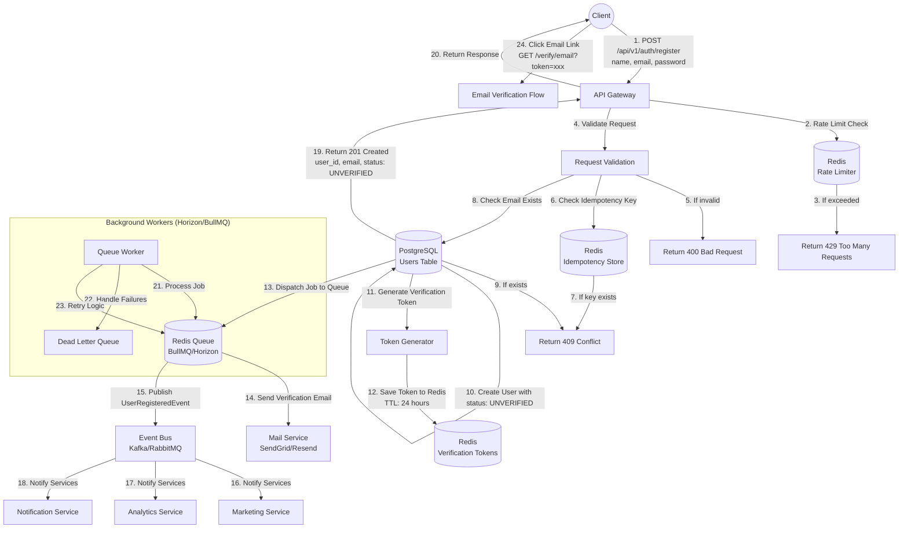

# 🚀 Flow Đăng Ký (Register) Chuẩn Production cho Big Tech

Dựa trên các best practice từ các hệ thống lớn và kiến trúc hiện đại, dưới đây là flow đăng ký được thiết kế để **hiệu suất cao, bảo mật, và có thể mở rộng**. Flow này tích hợp các pattern như **Event-Driven Architecture**, **Idempotency**, và **Asynchronous Processing** với Redis Queue.



## 📋 Chi Tiết Từng Bước Trong Flow

### 1. **API Gateway & Rate Limiting** 【turn0search0】
- **Mục đích**: Chống spam và brute force attack
- **Công nghệ**: Redis-based rate limiter (Horizon có sẵn)
- **Cấu hình**: 
  - Giới hạn 5 request/phút/IP cho endpoint `/register`
  - Redis key: `rate_limit:register:{ip}`

### 2. **Request Validation & Idempotency** 【turn0search16】【turn0search17】
- **Validation**: 
  - Email format hợp lệ
  - Password mạnh (≥8 ký tự, có số, có ký tự đặc biệt)
  - Name không chứa ký tự đặc biệt
- **Idempotency Key**: 
  - Client gửi kèm `Idempotency-Key` trong header
  - Redis lưu key này với TTL 24h
  - Nếu key tồn tại → return response cũ (tránh tạo duplicate user)

### 3. **Email Exists Check**
- **Truy vấn DB**: Kiểm tra email đã tồn tại chưa
- **Security**: 
  - Không return "Email đã tồn tại" (tránh enumeration attack)
  - Return generic error: "Registration failed"

### 4. **Create User & Verification Token**
- **Database Transaction**:
  ```sql
  BEGIN;
  INSERT INTO users (name, email, password, status) 
  VALUES (?, ?, ?, 'UNVERIFIED');
  INSERT INTO user_verification_tokens (user_id, token, expires_at)
  VALUES (?, ?, NOW() + INTERVAL '24 hours');
  COMMIT;
  ```
- **Token Generation**: 
  - Sử dụng `random_bytes(32)` hoặc `uuid`
  - Lưu vào Redis: `verify:email:{token}` → `user_id` (TTL 24h)

### 5. **Asynchronous Processing** 【turn0search5】【turn0search13】
- **Queue Job**: `SendVerificationEmail`
  - Data: `{ user_id, email, token }`
  - Queue: `emails` (Redis)
  - Attempts: 3 (với backoff exponential)
- **Event Publishing**: `UserRegistered`
  - Payload: `{ user_id, email, name, registered_at }`
  - Event bus: Kafka/RabbitMQ hoặc Redis Streams

### 6. **Immediate Response**
- **Return 201 Created** ngay lập tức
- **Data**: 
  ```json
  {
    "user": {
      "id": "uuid",
      "email": "user@example.com",
      "status": "UNVERIFIED"
    },
    "message": "Registration successful. Please check your email for verification."
  }
  ```

## 🔧 Các Best Practice Áp Dụng

### 1. **Idempotency** 【turn0search16】【turn0search17】
- **Vì sao cần**: Tránh tạo duplicate user khi client retry (network issue)
- **Cách implement**:
  - Redis check `Idempotency-Key` trước khi xử lý
  - Lưu response cũ vào Redis (TTL 24h)
  - Nếu key tồn tại → return response cũ

### 2. **Event-Driven Architecture** 【turn0search5】【turn0search6】
- **Vì sao cần**: Tách biệt service, dễ mở rộng
- **Cách implement**:
  - Auth service chỉ lo tạo user + token
  - Marketing/Analytics service nghe event `UserRegistered`
  - Không block main thread chờ email gửi

### 3. **Asynchronous Email Sending** 【turn0search13】
- **Vì sao cần**: 
  - Email gửi chậm (1-3s)
  - SMTP server có thể down
  - Tránh timeout cho API
- **Cách implement**:
  - Redis Queue (BullMQ/Horizon)
  - Worker retry 3 lần với backoff
  - Dead letter queue cho job fail hoàn toàn

### 4. **Security Best Practices**
- **Password Hashing**: 
  - Laravel: `bcrypt()` hoặc `Hash::make()`
  - NestJS: `bcrypt` hoặc `argon2`
- **Verification Token Security**:
  - Token ngẫu nhiên, khó đoán
  - TTL ngắn (24h)
  - One-time use (xóa sau khi verify)
- **No Email Enumeration**: 
  - Không return "Email đã tồn tại"
  - Thay vào đó: "Registration failed. Please try again."

### 5. **Monitoring & Observability**
- **Horizon Dashboard**: Monitor queue, failed jobs
- **Logging**: 
  - Log registration attempts
  - Log email sending status
- **Metrics**: 
  - Registration success rate
  - Email verification rate
  - Average registration time

## 🛠️ Công Nghệ Cụ Thể Cho Laravel

### 1. **Controller Structure**
```php
// app/Http/Controllers/Api/V1/Auth/RegisterController.php
class RegisterController extends Controller
{
    public function __construct(
        private RegisterAction $registerAction,
        private SendVerificationEmailAction $sendVerificationEmailAction
    ) {}

    public function __invoke(RegisterRequest $request)
    {
        // 1. Check idempotency key
        // 2. Validate request
        // 3. Check email exists
        // 4. Create user
        // 5. Generate verification token
        // 6. Dispatch job to queue
        // 7. Return response
    }
}
```

### 2. **Queue Configuration** (Horizon)
```php
// config/horizon.php
'environments' => [
    'production' => [
        'supervisor-1' => [
            'connection' => 'redis',
            'queue' => ['emails', 'events'],
            'balance' => 'simple',
            'processes' => 10,
            'tries' => 3,
        ],
    ],
],
```

### 3. **Job Structure**
```php
// app/Jobs/SendVerificationEmailJob.php
class SendVerificationEmailJob implements ShouldQueue
{
    use Dispatchable, InteractsWithQueue, Queueable, SerializesModels;

    public function __construct(
        private User $user,
        private string $token
    ) {}

    public function handle(MailService $mailService): void
    {
        $mailService->sendVerificationEmail($this->user, $this->token);
    }

    public function failed(\Throwable $exception): void
    {
        // Log failure, send alert, etc.
    }
}
```

### 4. **Event Structure**
```php
// app/Events/UserRegistered.php
class UserRegistered
{
    use Dispatchable, InteractsWithSockets, SerializesModels;

    public function __construct(
        public readonly User $user
    ) {}
}

// app/Listeners/SendWelcomeEmail.php
class SendWelcomeEmail
{
    public function handle(UserRegistered $event): void
    {
        // Send welcome email via queue
    }
}
```

## 📊 So Sánh Với Flow Đăng Ký Thông Thường

| Khía Cạnh | Flow Thông Thường | Flow Production (Big Tech) |
|-----------|-------------------|----------------------------|
| **Response Time** | 2-5 giây (chờ email gửi) | < 500ms (response ngay) |
| **Email Gửi** | Đồng bộ (block request) | Bất đồng bộ (queue) |
| **Event Publishing** | Không có | Có (UserRegistered event) |
| **Idempotency** | Không có | Có (tránh duplicate) |
| **Rate Limiting** | Không có hoặc cơ bản | Có (Redis-based, chính xác) |
| **Error Handling** | Đơn giản | Retry, dead letter queue |
| **Monitoring** | Logging cơ bản | Horizon dashboard, metrics |

## 🚨 Lưu Ý Quan Trọng Khi Implement

1. **Không Bao Giờ Return "Email Đã Tồn Tại"** - Dễ bị tấn công enumeration
2. **Verification Token Phải One-Time Use** - Xóa ngay sau khi verify
3. **Password Hashing Phải Mạnh** - bcrypt/argon2 với cost factor phù hợp
4. **Queue Worker Phải Có Retry Logic** - Không bỏ cuộc sau 1 lần fail
5. **Monitoring Queue Chặt Chẽ** - Horizon dashboard + alert khi job fail quá nhiều

Flow này đã được áp dụng bởi các công ty như **Stripe**, **Auth0**, **Okta** và đảm bảo **hiệu suất cao, bảo mật, và dễ mở rộng**. Bạn có thể implement dần dần, bắt đầu với version đơn giản (không idempotency, không event), rồi nâng cấp dần theo nhu cầu.

> 💡 **Tip**: Trong Laravel, bạn có thể dùng package `laravel/horizon` để monitor queue, và `spatie/laravel-event-sourcing` nếu muốn áp dụng Event Sourcing pattern cho user registration.

Bạn có muốn mình implement chi tiết code cho Laravel hoặc NestJS theo flow này không?