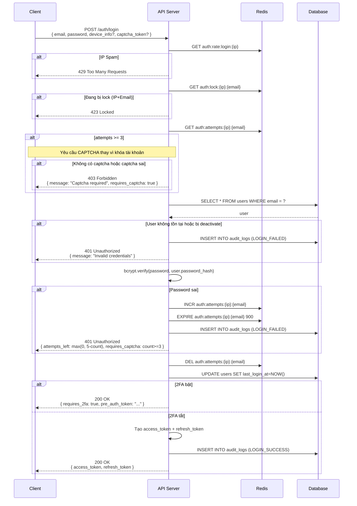

```mermaid
sequenceDiagram
    participant C as Client
    participant API as API Server
    participant Redis as Redis
    participant DB as Database

    C->>API: POST /auth/login<br/>{ email, password, device_info?, captcha_token? }

    API->>Redis: GET auth:rate:login:{ip}
    alt IP Spam
        API-->>C: 429 Too Many Requests
    end

    API->>Redis: GET auth:lock:{ip}:{email}
    alt Đang bị lock (IP+Email)
        API-->>C: 423 Locked
    end

    API->>Redis: GET auth:attempts:{ip}:{email}
    alt attempts >= 3
        Note over API,C: Yêu cầu CAPTCHA thay vì khóa tài khoản
        alt Không có captcha hoặc captcha sai
            API-->>C: 403 Forbidden<br/>{ message: "Captcha required", requires_captcha: true }
        end
    end

    API->>DB: SELECT * FROM users WHERE email = ?
    DB-->>API: user

    alt User không tồn tại hoặc bị deactivate
        API->>DB: INSERT INTO audit_logs (LOGIN_FAILED)
        API-->>C: 401 Unauthorized<br/>{ message: "Invalid credentials" }
    end

    API->>API: bcrypt.verify(password, user.password_hash)

    alt Password sai
        API->>Redis: INCR auth:attempts:{ip}:{email}
        API->>Redis: EXPIRE auth:attempts:{ip}:{email} 900
        API->>DB: INSERT INTO audit_logs (LOGIN_FAILED)
        API-->>C: 401 Unauthorized<br/>{ attempts_left: max(0, 5-count), requires_captcha: count>=3 }
    end

    API->>Redis: DEL auth:attempts:{ip}:{email}
    API->>DB: UPDATE users SET last_login_at=NOW()
    
    alt 2FA bật
        API-->>C: 200 OK<br/>{ requires_2fa: true, pre_auth_token: "..." }
    else 2FA tắt
        API->>API: Tạo access_token + refresh_token
        API->>DB: INSERT INTO audit_logs (LOGIN_SUCCESS)
        API-->>C: 200 OK<br/>{ access_token, refresh_token }
    end
```